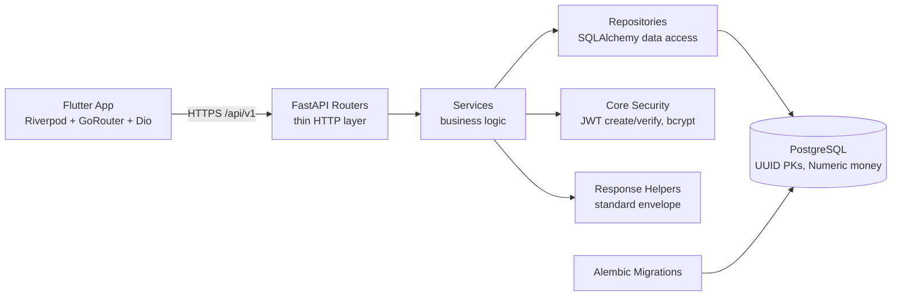

# 02 — System Architecture

> **Project:** Construction ERP  
> **Sprint:** S01  
> **Period:** 2026-07-06 to 2026-07-17  
> **Lead:** Tech Lead  
> **Goal:** Establish the system foundation (FastAPI, PostgreSQL, JWT auth for a single admin) and deliver core Client and Project management with full CRUD on backend and Flutter screens.  
> **Source:** Construction ERP Software Requirements & Technical Documentation v1.0  
> **Status:** Developer Specification

## 1. High-Level Diagram



The Flutter client is the only intended consumer of `/api/v1`. There is no public API, no BFF, no message broker. All cross-cutting concerns (auth, envelope, error mapping) live in `app/core`.

## 2. Backend Layers

| Layer | Path | Responsibility | Allowed to call |
| --- | --- | --- | --- |
| Routers | `app/routers` | Parse request, call service, return envelope. No business logic. | Services only |
| Services | `app/services` | Business rules, validation, orchestration. | Repositories, core |
| Repositories | `app/repositories` | SQLAlchemy queries; returns models. Nothing about HTTP. | Models, DB session |
| Models | `app/models` | ORM definitions, relationships. | SQLAlchemy only |
| Schemas | `app/schemas` | Pydantic v2 request/response DTOs. | Nothing |
| Core | `app/core` | Config, DB session, security, envelope helpers. | — |
| Utils | `app/utils` | Pure helpers. | — |

## 3. Modules in Scope

| Module | Owner task | Notes |
| --- | --- | --- |
| Foundation | S01-T01 | FastAPI app, health endpoints, envelope, error handlers. |
| Database | S01-T02 | Alembic env, initial revision, pgcrypto, three tables. |
| Auth | S01-T03 | `/auth/login`, JWT create/verify, `OAuth2PasswordBearer`. |
| Users | S01-T04 | `User` model, seed script. |
| Clients | S01-T05 | Client model/schema/repo/service/router. |
| Projects | S01-T06 | Project model/schema/repo/service/router. |
| Flutter Layout | S01-T07 | App shell, sidebar, routing. |
| Flutter Login | S01-T07 | Login screen, token storage, dio auth interceptor. |
| Tests | S01-T09 | Pytest fixtures, TestClient flows. |

## 4. Sources of Truth

| Table | Key fields | Source of truth for |
| --- | --- | --- | 
| `users` | id, email (unique), password_hash, role, created_at | The single admin identity. |
| `clients` | id, name, phone, email, address, notes, archived, timestamps | Client master records. |
| `projects` | id, client_id (FK), name, description, budget (Numeric), dates, status | Project records linked to clients. |

Alembic migrations are the canonical schema definition; models mirror them but do not override them.

## 5. Request Flow (typical write)

1. Flutter Dio sends `POST /api/v1/clients` with `Authorization: Bearer <jwt>`.
2. Router extracts token; `OAuth2PasswordBearer` dependency verifies it via `core.security`.
3. Router loads the schema (`ClientCreate`), calls `ClientService.create`.
4. Service validates business rules, calls `ClientRepository.create`.
5. Repository persists via SQLAlchemy session, returns `Client` model.
6. Service maps model → `ClientRead` schema; router wraps in success envelope.

## 6. Transaction Boundaries

- One SQLAlchemy session per request (FastAPI dependency `get_db`).
- Service methods commit within a single transaction; on exception the session rolls back.
- No cross-request transactions; no background jobs this sprint.

## 7. Frontend Architecture

```mermaid
flowchart TD
    UI[Presentation<br/>Screens + Providers] --> DOM[Domain<br/>Entities]
    UI --> DATA[Data<br/>Dio + Repositories + DTOs]
    DATA --> NET[core/network<br/>DioProvider + interceptors]
    NET --> API[/api/v1]
    ROUTER[core/router<br/>GoRouter] --> UI
```

Feature folders: `lib/features/auth`, `lib/features/clients`, `lib/features/projects`; shared `lib/core/{config,constants,network,router,theme}`.

## 8. ADR Decisions

| ADR | Decision | Rationale |
| --- | --- | --- |
| ADR-01 | Single admin, no RBAC in v1 | Scope control; add roles later. |
| ADR-02 | UUID PKs via `gen_random_uuid()` | Avoid sequential enumeration; distributed-safe. |
| ADR-03 | `Numeric(14,2)` for money | Exact decimal; never float. |
| ADR-04 | Alembic as source of truth | Reproducible schema; no manual DDL. |
| ADR-05 | Standard JSON envelope on every response | Consistent client-side unwrapping. |
| ADR-06 | JWT access tokens, no refresh in v1 | Simplicity; refresh added when mobile goes live. |