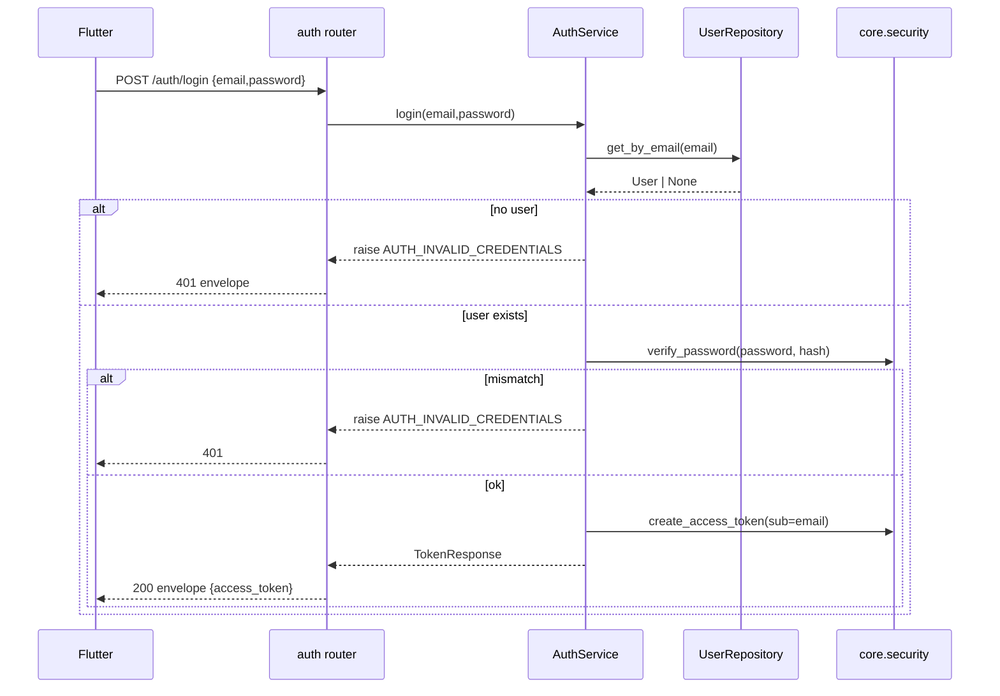
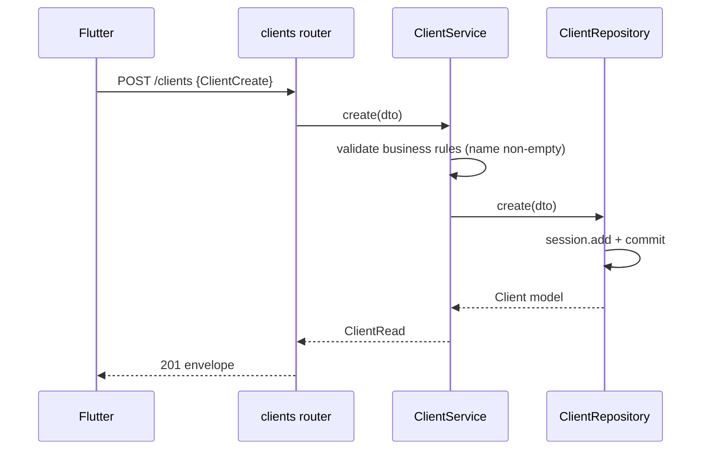
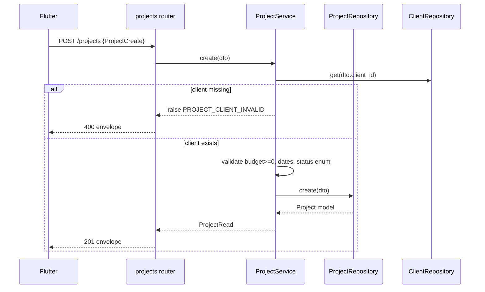
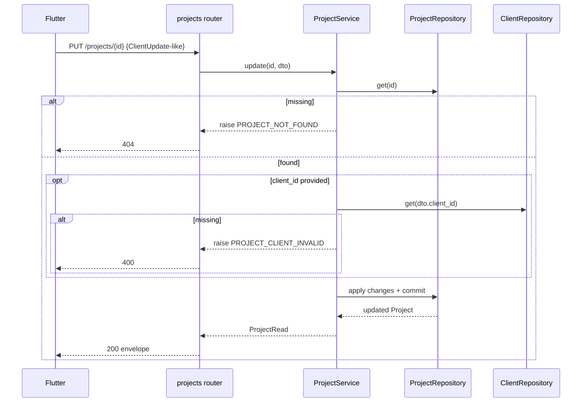
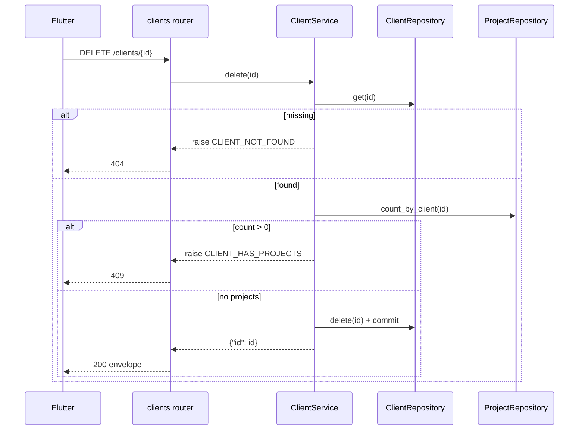

# 07 — Service Workflows

> **Project:** Construction ERP  
> **Sprint:** S01  
> **Period:** 2026-07-06 to 2026-07-17  
> **Lead:** Tech Lead  
> **Goal:** Establish the system foundation (FastAPI, PostgreSQL, JWT auth for a single admin) and deliver core Client and Project management with full CRUD on backend and Flutter screens.  
> **Source:** Construction ERP Software Requirements & Technical Documentation v1.0  
> **Status:** Developer Specification

## 1. Login Flow

**Rules:** constant-time compare (bcrypt). Never reveal whether email exists vs password wrong — same 401 code/message.

## 2. Create Client

**Rules:** `name` min 1 char; `email` (if present) must be valid email; `archived` defaults false. No uniqueness on client email.

## 3. Create Project (validate client_id)

**Rules:** `client_id` must resolve to a non-archived or archived (any) existing client; `budget` non-negative; `end_date >= start_date` if both set.

## 4. Update Project

## 5. Delete Client (block if projects exist)

**Rules:** Deletion of a client with linked projects is **blocked** (no cascade) to preserve project history. The admin must reassign or delete projects first.

## 6. Cross-cutting Business Rules

- All mutations require a valid JWT (router dependency).
- Every service method runs inside the request DB session and commits on success.
- On any raised `AppException`, the global exception handler maps it to the error envelope with the correct HTTP code.
- `updated_at` maintained by DB trigger on `clients`.