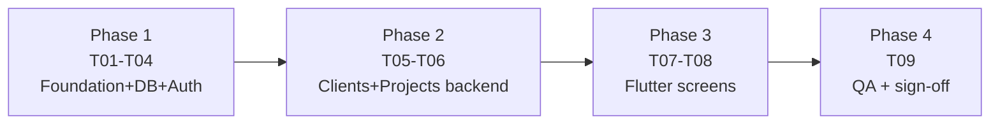

# 12 — Implementation Roadmap

> **Project:** Construction ERP  
> **Sprint:** S01  
> **Period:** 2026-07-06 to 2026-07-17  
> **Lead:** Tech Lead  
> **Goal:** Establish the system foundation (FastAPI, PostgreSQL, JWT auth for a single admin) and deliver core Client and Project management with full CRUD on backend and Flutter screens.  
> **Source:** Construction ERP Software Requirements & Technical Documentation v1.0  
> **Status:** Developer Specification

## 1. Summary

| Item | Value |
| --- | --- |
| Sprint ID | S01 |
| Period | 2026-07-06 to 2026-07-17 |
| Total story points | 61 |
| Lead | Tech Lead |
| Review gate | Sprint demo + QA report sign-off |

## 2. Backlog

| ID | Epic/Module | Task | Owner | Priority | SP | Dep | Acceptance | Deliverable |
| --- | --- | --- | --- | --- | --- | --- | --- | --- |
| S01-T01 | Foundation / Backend | FastAPI skeleton (core, routers, services, repositories, models, schemas) | Backend | Critical | 8 | Sprint 00 | Health endpoint returns standard envelope | Backend Skeleton |
| S01-T02 | Foundation / Database | PostgreSQL + Alembic + .env | Backend | Critical | 5 | S01-T01 | `alembic upgrade head` runs cleanly | DB Setup |
| S01-T03 | Security / Auth | JWT auth (single admin, bcrypt, login) | Backend | Critical | 8 | S01-T02 | Protected routes reject missing/invalid tokens; login returns JWT | Auth API |
| S01-T04 | Admin / Users | Seed single admin + User model | Backend | High | 3 | S01-T03 | Seed creates exactly one admin; login works | User Model + Seed |
| S01-T05 | Clients / Backend | Client CRUD | Backend | Critical | 8 | S01-T02 | CRUD works; envelope; search by name | Clients API |
| S01-T06 | Projects / Backend | Project CRUD linked to client | Backend | Critical | 8 | S01-T05 | Requires valid client_id; budget Numeric | Projects API |
| S01-T07 | Clients+Projects / Frontend | Flutter login + layout + client screens | Frontend | High | 8 | S01-T03, S01-T05 | Admin can log in, CRUD clients, view detail | Client Screens |
| S01-T08 | Projects / Frontend | Flutter project screens linked to client | Frontend | High | 8 | S01-T06, S01-T07 | Admin can create/edit projects tied to client | Project Screens |
| S01-T09 | QA / Tests | Auth + Client/Project endpoint tests | QA | High | 5 | S01-T03, S01-T05, S01-T06 | Test report covers login + CRUD validation | QA Report |

## 3. Phases

| Phase | Days | Tasks | Exit |
| --- | --- | --- | --- |
| 1 | 2026-07-06 → 07-09 | T01, T02, T03, T04 | App boots, migrations apply, login works |
| 2 | 2026-07-10 → 07-13 | T05, T06 | Clients + Projects APIs pass integration tests |
| 3 | 2026-07-14 → 07-16 | T07, T08 | Flutter end-to-end round trip |
| 4 | 2026-07-17 | T09 | QA report + demo + sign-off |

## 4. Critical Path

T01 → T02 → T03 → T04 → T05 → T06 → T07 → T08 → T09. Frontend can stub against the OpenAPI contract from end of Phase 1 to parallelise, but final integration depends on Phase 2 APIs.

## 5. Delivery Style

- One branch per task: `feature/S01-T0X-short-name`.
- Small PRs (≤ 400 LOC ideal); at least one reviewer.
- Every schema/migration PR includes the migration + model + tests together.
- Every API PR includes the endpoint + service + repository + tests.
- Frontend PR includes feature folder + providers + screens + manual QA note.

## 6. Risks

| Risk | Likelihood | Impact | Mitigation |
| --- | --- | --- | --- |
| Alembic autogenerate drift | Med | Med | Review + hand-edit migration; test up + down |
| JWT secret misconfiguration | Low | High | Validate at startup; fail fast if missing/short |
| Money rounding bugs | Med | High | Decimal end-to-end; tests assert string compare |
| Flutter Dio envelope handling | Med | Med | Centralised interceptor; one integration test |
| Scope creep (extra modules) | Med | High | Strict PRD out-of-scope; defer to S02 |
| Single-admin assumption breaks | Low | Med | Document; design for future roles |

## 7. Definition of Done (per task)

- Code merged to main, builds locally and in CI.
- Tests added and passing.
- Migration (if any) applied up + down.
- OpenAPI/contract updated.
- Docs touched where relevant.
- QA checklist item satisfied.
- Demo-able in the sprint review.

## 8. Sprint Exit

All Critical tasks (T01-T06) merged and green; T07/T08 demoed; T09 QA report attached; no P0 defects; Tech Lead sign-off.