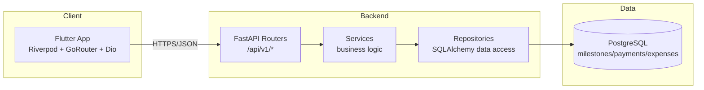

# 02 — System Architecture — Sprint S02

> **Project:** Construction ERP  
> **Sprint:** S02  
> **Period:** 2026-07-20 to 2026-07-31  
> **Lead:** Tech Lead  
> **Goal:** Add financial tracking — milestones, payments, and expenses linked to projects — with CRUD APIs, Flutter screens, and a project profitability service.  
> **Source:** Construction ERP Software Requirements & Technical Documentation v1.0  
> **Status:** Developer Specification

## 1. Architecture Overview

Construction ERP keeps the Sprint 01 layered architecture. Sprint S02 adds three domain modules (milestones, payments, expenses) and one derived computation module (profitability) without introducing new infrastructure.

## 2. Layer Responsibilities

| Layer | Location | Responsibility in S02 |
| --- | --- | --- |
| Routers | `app/routers/milestones.py`, `payments.py`, `expenses.py`, `profitability.py` | Thin HTTP: parse request, call service, build envelope. |
| Services | `app/services/milestone_service.py`, `payment_service.py`, `expense_service.py`, `project_profitability_service.py` | Business rules: validation, status transitions, profitability math. |
| Repositories | `app/repositories/milestone_repository.py`, `payment_repository.py`, `expense_repository.py` | SQLAlchemy queries, sums, filtering by `project_id`. |
| Models | `app/models/milestone.py`, `payment.py`, `expense.py` | ORM tables with UUID PK, FK, Numeric amounts, enum columns. |
| Schemas | `app/schemas/milestone.py`, `payment.py`, `expense.py`, `profitability.py` | Pydantic v2 DTOs (Create/Read/Update). |
| Core | `app/core/security.py`, `database.py`, `response.py` | JWT dependency, session, envelope helpers. |

## 3. New Modules

- **Milestones** — project-scoped checkpoints with due date and lifecycle status.
- **Payments** — project-scoped monetary inflows (`amount`, `method`, `payment_date`).
- **Expenses** — project-scoped monetary outflows (`category`, `amount`, `expense_date`).
- **Profitability** — stateless service that aggregates payments and expenses for a project; no table of its own.

## 4. Sources of Truth

| Aggregate | Table | Key Fields | Owner Service |
| --- | --- | --- | --- |
| Milestone | `milestones` | id, project_id, title, due_date, status, created_at | MilestoneService |
| Payment | `payments` | id, project_id, amount (Numeric), payment_date, method, notes, created_at | PaymentService |
| Expense | `expenses` | id, project_id, category, amount (Numeric), expense_date, notes, created_at | ExpenseService |
| Profitability | *(derived)* | total_payments, total_expenses, balance, profit_margin | ProjectProfitabilityService |

## 5. Transaction Boundaries

- **Payment/Expense create is atomic.** A single DB transaction validates the `project_id`, inserts the record, and commits. On any exception the transaction rolls back, ensuring no partial/orphan record.
- **Profitability is read-only** and runs two aggregate `SUM` queries inside one transaction for consistency.
- **Milestone status transition** is a single `UPDATE` guarded by enum validation; `overdue` is derived on read, not stored as a separate write.

## 6. Architecture Decision Records (ADR)

### ADR-S02-01 — Money is Decimal, never float
**Decision:** All monetary amounts use `NUMERIC(14,2)` in PostgreSQL and `Decimal` in Python/Pydantic.  
**Rationale:** Float rounding errors are unacceptable for financial accounting. `NUMERIC(14,2)` supports up to 999,999,999,999.99 with exact cents.  
**Consequences:** Schemas declare `Decimal` with `max_digits=14, decimal_places=2`; no `float` fields anywhere in the financial path.

### ADR-S02-02 — Derived balances are computed on demand, not stored
**Decision:** `balance` and `profit_margin` are computed by `ProjectProfitabilityService` from live `SUM(amount)` queries; no `balance` column is persisted on `projects`.  
**Rationale:** A stored balance would diverge from the source rows on any edit/delete and require re-sync logic. Computing on demand is always correct and cheap at this scale (single admin).  
**Consequences:** Profitability endpoint runs two indexed `SUM` aggregations; `project_id` and amount columns are indexed for performance.

### ADR-S02-03 — Cascade delete from projects to financials
**Decision:** `payments`, `expenses`, and `milestones` foreign keys use `ON DELETE CASCADE` from `projects`.  
**Rationale:** A project deletion removes all its financial history, preventing orphaned money records that would break profitability sums.  
**Consequences:** Project delete is destructive; documented as a known behavior for v1.