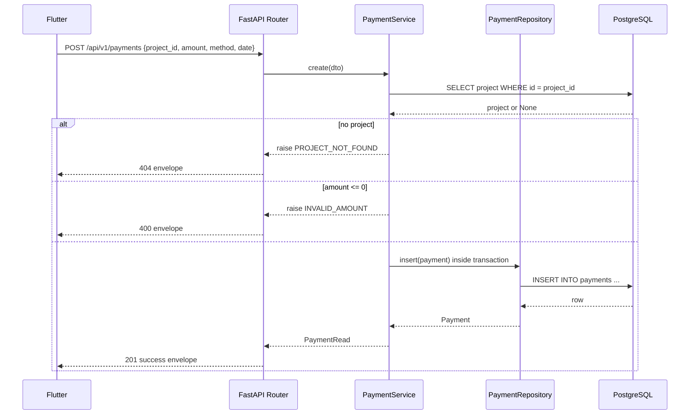
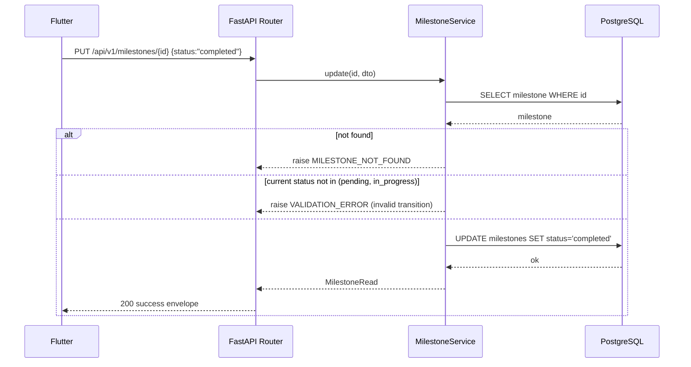
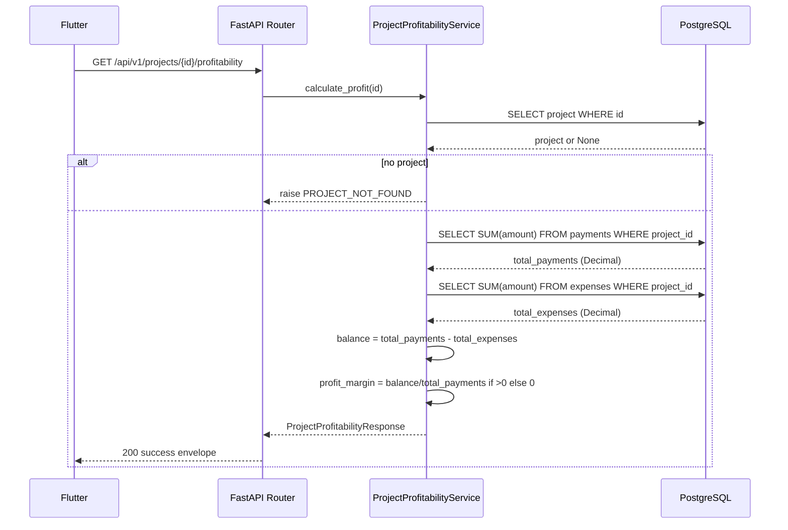

# 07 — Service Workflows — Sprint S02

> **Project:** Construction ERP  
> **Sprint:** S02  
> **Period:** 2026-07-20 to 2026-07-31  
> **Lead:** Tech Lead  
> **Goal:** Add financial tracking — milestones, payments, and expenses linked to projects — with CRUD APIs, Flutter screens, and a project profitability service.  
> **Source:** Construction ERP Software Requirements & Technical Documentation v1.0  
> **Status:** Developer Specification

## 1. Create Payment

**Business rules:** `project_id` must exist; `amount > 0`; `method` ∈ enum; the insert is atomic (single transaction).

## 2. Create Expense

Identical sequence to Create Payment, swapping `ExpenseService` / `ExpenseRepository` / `expenses` table and validating `category` against the allowlist. Same atomic insert, same `PROJECT_NOT_FOUND` / `INVALID_AMOUNT` / `INVALID_CATEGORY` outcomes.

## 3. Complete Milestone (status transition)

**Status machine:** `pending → in_progress → completed`. `overdue` is derived on read when `due_date < today` and `status != completed`. A completed milestone cannot be re-opened (VALIDATION_ERROR).

## 4. Calculate Profitability

**Business rules:** both `SUM` queries run in one transaction for a consistent snapshot; `profit_margin` is rounded to 2 decimals; result is read-only, no row is mutated.

## 5. Overdue Detection (read-time)

When listing/reading milestones, the service checks `due_date < date.today()` and `status` ∈ {pending, in_progress}; if so, the returned `status` is `overdue` without writing to the DB. This keeps the source of truth intact and avoids background jobs in v1.