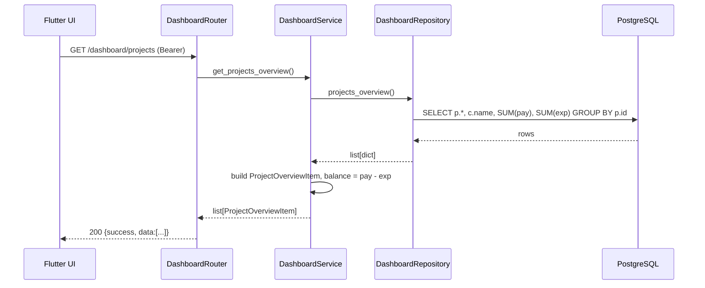
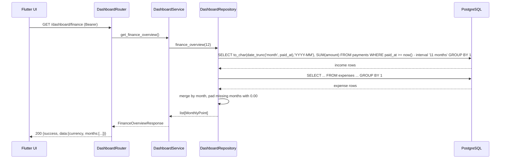

# 07 — Service Workflows (Sprint 03 Dashboard)

> **Project:** Construction ERP  
> **Sprint:** S03  
> **Period:** 2026-08-03 to 2026-08-14  
> **Lead:** Tech Lead  
> **Goal:** Deliver a management dashboard with KPIs, summary cards, and charts aggregating active/completed projects, outstanding balances, and financial overview.  
> **Source:** Construction ERP Software Requirements & Technical Documentation v1.0  
> **Status:** Developer Specification

## 1. Summary Request
```mermaid
sequenceDiagram
    participant UI as Flutter UI
    participant API as DashboardRouter
    participant SVC as DashboardService
    participant REP as DashboardRepository
    participant DB as PostgreSQL
    UI->>API: GET /dashboard/summary (Bearer)
    API->>API: verify JWT
    API->>SVC: get_summary()
    SVC->>REP: counts()
    REP->>DB: SELECT status, COUNT(*) FROM projects GROUP BY status
    DB-->>REP: {active, completed}
    REP->>DB: SELECT COUNT(*) FROM clients
    DB-->>REP: total_clients
    REP-->>SVC: counts
    SVC->>REP: totals()
    REP->>DB: SELECT SUM(amount) FROM payments; SUM(amount) FROM expenses
    DB-->>REP: payments, expenses
    REP-->>SVC: totals
    SVC->>SVC: outstanding = payments - expenses
    SVC-->>API: DashboardSummaryResponse
    API-->>UI: 200 {success, data}
```

## 2. Projects Overview Request


## 3. Finance Overview Request


## 4. Business Rules Applied in Workflows
| Rule | Where enforced |
| --- | --- |
| Read-only — no INSERT/UPDATE/DELETE | Repository exposes only SELECT queries |
| UTC consistency | `date_trunc('month', <timestamptz>)` operates in UTC |
| Decimal precision | Repository returns `Decimal`; service does not coerce to float |
| Single admin scope | JWT dependency gates endpoints; no tenant filter needed |
| 12-month window | Repository hard-codes `NOW() - INTERVAL '11 months'` (inclusive of current month) |
| Missing months padded | Service fills gaps with `MonthlyPoint(income=0, expense=0)` |

## 5. Failure Handling
- Repository raises `SQLAlchemyError` → service maps to `AGGREGATION_ERROR`.
- JWT invalid → router returns `401 AUTH_TOKEN_EXPIRED` before reaching service.
- Empty data (no projects/payments) → service returns zero-valued DTOs, **not** an error.

## 6. Concurrency
- The three endpoints are independent; the frontend fires them in parallel.
- Each request opens its own DB session via `Depends(get_db)`; no shared transaction state.