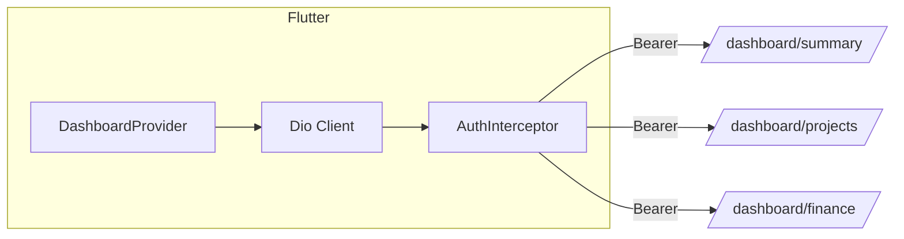

# 14 — Integration with Core APIs (Sprint 03 Dashboard)

> **Project:** Construction ERP  
> **Sprint:** S03  
> **Period:** 2026-08-03 to 2026-08-14  
> **Lead:** Tech Lead  
> **Goal:** Deliver a management dashboard with KPIs, summary cards, and charts aggregating active/completed projects, outstanding balances, and financial overview.  
> **Source:** Construction ERP Software Requirements & Technical Documentation v1.0  
> **Status:** Developer Specification

## 1. Integration Overview
The Flutter `DashboardProvider` consumes the three new Sprint 03 endpoints, in parallel, alongside existing Sprint 02 endpoints (clients/projects/payments/expenses) which remain the source of truth for detail navigation.



## 2. Parallel Fetch
```dart
Future<(DashboardSummary, List<ProjectOverview>, FinanceOverview)> fetchAll() async {
  return (
    await Future.wait([
      _dio.get(Endpoints.dashboardSummary),
      _dio.get(Endpoints.dashboardProjects),
      _dio.get(Endpoints.dashboardFinance),
    ]),
  ).then((rs) => tuple3(rs[0], rs[1], rs[2]));
}
```
- All three use the shared `Dio` instance with `AuthInterceptor` from S01.
- One failure does not cancel the others; provider keeps partial state and reports per-section error.

## 3. Envelope Unwrap
```dart
T unwrap<T>(Response res, T Function(Map<String,dynamic>) fromJson) {
  final body = res.data as Map<String,dynamic>;
  if (body['success'] != true) {
    final err = (body['errors'] as List).first;
    throw DashboardException(err['code'], err['message']);
  }
  return fromJson(body['data'] as Map<String,dynamic>);
}
```
On `success:false`, provider maps `code` to a typed failure (see `10_Error_Codes_and_Response_Standards.md`).

## 4. DTO → Entity → Chart Data
```dart
// DTO
class DashboardSummaryDto { final int activeProjects; ... factory fromJson(Map j) => ...; }
// Entity
class DashboardSummary { final int activeProjects; final Decimal outstandingBalances; ... }
// Mapping
DashboardSummary toEntity(DashboardSummaryDto d) => DashboardSummary(
  activeProjects: d.activeProjects,
  completedProjects: d.completedProjects,
  totalClients: d.totalClients,
  outstandingBalances: Decimal.parse(d.outstandingBalances),
  totalPayments: Decimal.parse(d.totalPayments),
  totalExpenses: Decimal.parse(d.totalExpenses),
);
```

## 5. Chart Data Transformation
`FinanceOverview.months` → `BarChart` data:
```dart
List<BarChartGroupData> toBars(List<MonthlyPoint> ms) => List.generate(ms.length, (i) {
  final m = ms[i];
  return BarChartGroupData(x: i, barRods: [
    BarChartRodData(toY: m.income.toDouble(), color: Colors.green),
    BarChartRodData(toY: m.expense.toDouble(), color: Colors.red),
  ]);
});
```
X-axis labels: `mm` derived from `month.split('-').last`.

## 6. Riverpod State Surface
```dart
class DashboardState {
  final AsyncValue<DashboardSummary> summary;
  final AsyncValue<List<ProjectOverview>> projects;
  final AsyncValue<FinanceOverview> finance;
  final DateTime? lastRefresh;
}
```
`AsyncValue` per section lets the UI show partial loading (cards ready while chart still spinning).

## 7. Navigation to Detail
Tapping a project row navigates to the existing Sprint 02 project detail route `/projects/{id}` — no new detail endpoint needed.

## 8. Error Propagation
| Code | Frontend action |
| --- | --- |
| `AUTH_TOKEN_EXPIRED` | clear token, go to `/login` |
| `DASHBOARD_UNAVAILABLE` | banner + auto-retry backoff (3 attempts) |
| `AGGREGATION_ERROR` | banner + manual retry |
| `RATE_LIMIT_EXCEEDED` | toast with countdown, auto-retry after `Retry-After` |

## 9. Caching
- No client cache in S03 (always fresh on refresh).
- Dio `CacheInterceptor` is **disabled** for dashboard endpoints.
- Reserved `dashboard_cache_hits_total` metric (09) for a future server cache.

## 10. Compatibility
- No change to Sprint 02 endpoints; dashboard only reads.
- OpenAPI export updated to include the 3 new paths.
- Postman collection gains a "Dashboard" folder mirroring these endpoints.