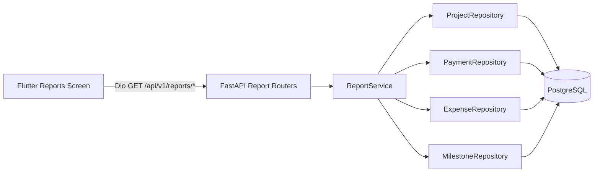

# Sprint 04 — System Architecture

> **Project:** Construction ERP  
> **Sprint:** S04  
> **Period:** 2026-08-17 to 2026-08-28  
> **Lead:** Tech Lead  
> **Goal:** Add reporting capabilities — project status, financial summary, and expense analysis reports — filterable by date range and project, export-ready.  
> **Source:** Construction ERP Software Requirements & Technical Documentation v1.0  
> **Status:** Developer Specification

## 1. Architecture Overview

Sprint 04 adds a read-only reporting layer on top of the existing domain modules. No new persistent tables are introduced; reports are computed on demand via aggregation queries over existing `projects`, `clients`, `milestones`, `payments`, and `expenses` tables.

## 2. Backend Layers

- **Routers** (`app/routers/reports.py`): 3 GET endpoints, JWT required, query param validation, response envelope.
- **Services** (`app/services/report_service.py`): orchestration — `project_status_report`, `financial_summary_report`, `expense_analysis_report`. Pure read paths; no writes.
- **Repositories** (`app/repositories/`): aggregation queries with optional filters (`project_id`, `status`, `start_date`, `end_date`). Reuse existing repositories; add report-specific query methods.
- **Schemas** (`app/schemas/reports.py`): response DTOs — `ProjectStatusReportItem`, `FinancialSummaryReport`, `ExpenseAnalysisReport` (with category breakdown).
- **Models**: unchanged.

## 3. New Module: Reports

A new `reports` feature module is added across all layers. It is purely additive — no changes to existing routers/services/repos. It depends only on read access to existing entities.

## 4. Read-Model Approach

Reports compute on demand using SQL aggregation (`SUM`, `COUNT`, `GROUP BY`) rather than materialized views. Rationale:

- Data volume is modest (single admin, single-tenant).
- Avoids sync complexity of materialized views.
- Filters are dynamic (date range, project, status); pre-computation would limit flexibility.
- S05 export will reuse the same service methods.

## 5. Frontend Architecture

New feature-first module `lib/features/reports/` with the standard split:

- `data/` — `ReportsRepository` (Dio calls), DTOs, endpoints.
- `domain/` — `ReportsService`, report entities, mappers.
- `presentation/` — `ReportsScreen`, report type selector, date-range picker, project dropdown, result tables, simple chart widgets.

State management via Riverpod (`reportsProvider`), routing via GoRouter (`/reports`).

## 6. ADR — Reports Compute On Demand

**Decision:** Reports are computed on demand via aggregation queries; no new tables, no materialized views in S04.

**Context:** Need filterable reports (date range, project, status) for a single-tenant, single-admin system with modest data volume.

**Consequences:**
- (+) No sync jobs, no schema migrations, faster delivery.
- (+) Dynamic filters supported naturally.
- (-) Large date ranges may be slower; mitigated with indexes on `payment_date`, `expense_date`, `project_id`, `status`.
- (-) Repeated identical queries recompute; acceptable for current scale.

**Follow-up:** CSV/PDF export built on the same service methods in S05.