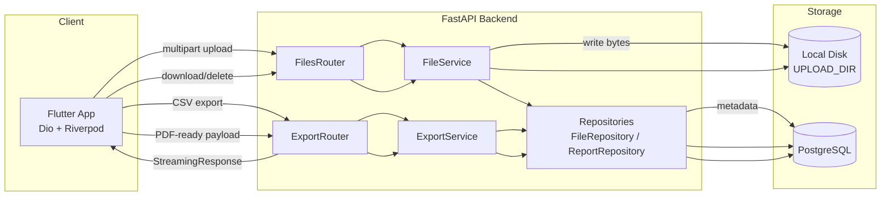

# Sprint 05 — System Architecture

> **Project:** Construction ERP  
> **Sprint:** S05  
> **Period:** 2026-08-31 to 2026-09-11  
> **Lead:** Tech Lead  
> **Goal:** Add file attachment management for projects and export support for reports (CSV) and project summaries (PDF-ready).  
> **Source:** Construction ERP Software Requirements & Technical Documentation v1.0  
> **Status:** Developer Specification

## 1. Architecture Overview

Sprint 05 introduces two new backend modules — **Files** and **Export** — without altering the existing layered architecture. Files are stored on local disk; metadata lives in PostgreSQL. Exports reuse Sprint 04 report aggregation and stream CSV or a PDF-ready JSON payload.



## 2. Layer Responsibilities

| Layer | Files Module | Export Module |
| --- | --- | --- |
| `app/routers` | `files.py`, handles multipart + streaming | `export.py`, handles CSV + JSON payload |
| `app/services` | `FileService` (disk I/O, path safety, delete atomicity) | `ExportService` (CSV formatting, project summary assembly) |
| `app/repositories` | `FileRepository` (insert/lookup/delete metadata) | Reuses `ReportRepository` from Sprint 04 |
| `app/models` | `FileModel` (SQLAlchemy) | — (no new table) |
| `app/schemas` | `FileMetadata`, `UploadResponse`, `ProjectExportPayload` | `CSVRow` (internal), reuses report schemas |
| `app/core` | `config.UPLOAD_DIR`, `config.MAX_FILE_SIZE_MB`, `config.ALLOWED_FILE_TYPES` | — |

## 3. New Modules

### 3.1 Files Module
- Upload: multipart form → validate → persist to disk → insert metadata → return `file_id`.
- Download: lookup metadata → stream bytes via `FileResponse`.
- Delete: transactional removal of disk file + DB row (disk first, then DB; failure on DB rolls back, disk file is restored/retried).
- List: `GET /files?project_id={id}` returns metadata only (no bytes).

### 3.2 Export Module
- CSV Export: aggregates via existing `ReportRepository`, formats as CSV, returns `StreamingResponse` with `text/csv`.
- Project Export: assembles project + milestones + payments + expenses into a single structured JSON payload.

## 4. Storage Decision

**v1: Local disk** under `UPLOAD_DIR` (default `./uploads`), organized as:

```
uploads/
  {project_id}/
    {file_id}-{sanitized_original_name}
```

Rationale: single-instance deployment, simplicity, no cloud dependency. A storage interface (`StorageBackend`) is sketched in the ADR but not implemented; swapping to S3 later is limited to `FileService`.

## 5. Architecture Decision Records (ADR)

| ADR | Decision | Rationale |
| --- | --- | --- |
| ADR-S05-01 | Files stored on local disk; metadata in PostgreSQL | Simplest correct solution for a single admin; avoids external service dependencies. Swap path is isolated in `FileService`. |
| ADR-S05-02 | CSV exported via `StreamingResponse` | Avoids building full CSV in memory; scales with report size. |
| ADR-S05-03 | PDF-ready JSON payload, not rendered PDF | PDF rendering libraries add heavy dependencies (wkhtmltopdf/WeasyPrint/reportlab). v1 returns structured data; client or Phase 2 renders PDF. Keeps backend lean. |
| ADR-S05-04 | On-disk path is UUID-based, not user filename | Prevents path traversal and filename collisions; user filename stored in metadata only. |
| ADR-S05-05 | Delete is transactional with disk-then-DB ordering | Ensures orphaned metadata is never left when disk removal succeeds; rollback re-uploads on DB failure. |

## 6. Cross-Sprint Integration

- **Sprint 01:** `projects` table is the FK target for `files.project_id`.
- **Sprint 04:** `ReportRepository` aggregations (project-status, financial-summary, expense-analysis) are reused unchanged by `ExportService`.
- **Sprint 05:** No changes to existing tables; adds `files` table and two routers.

## 7. Non-Functional Considerations

| Concern | Approach |
| --- | --- |
| Performance | Streaming responses for download and CSV; no full-buffer. |
| Security | JWT on all endpoints; path traversal blocked; content-type whitelist; size limit. |
| Reliability | Atomic delete (disk + DB); FK cascade for project deletion. |
| Maintainability | Storage backend isolated behind `FileService`; swap to S3 is a single-class change. |
| Observability | Structured logs + audit events (see `09_Logging_Audit_Analytics.md`). |