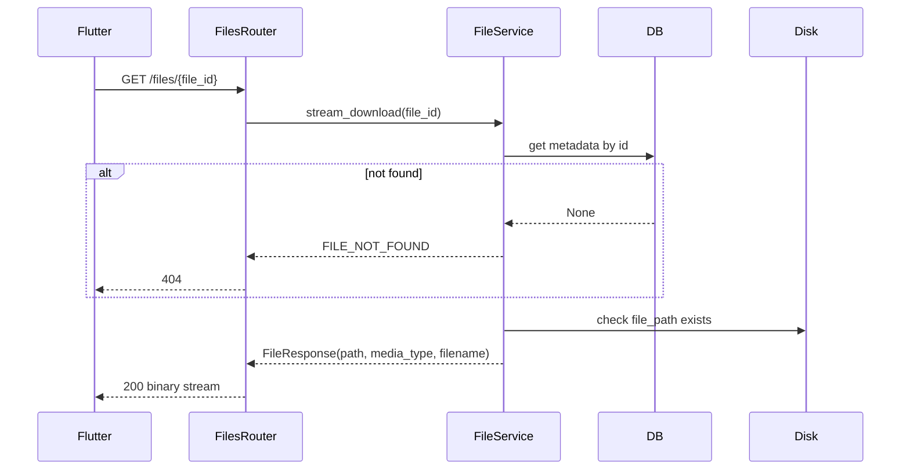
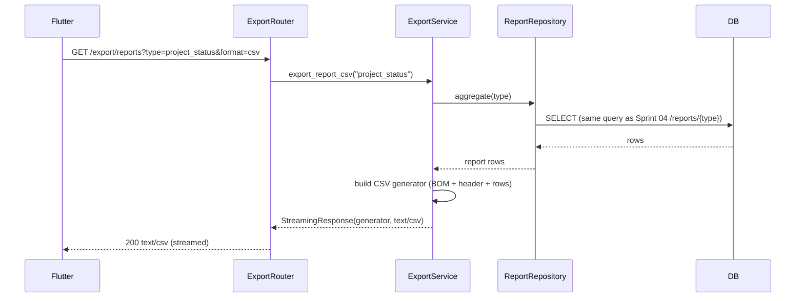
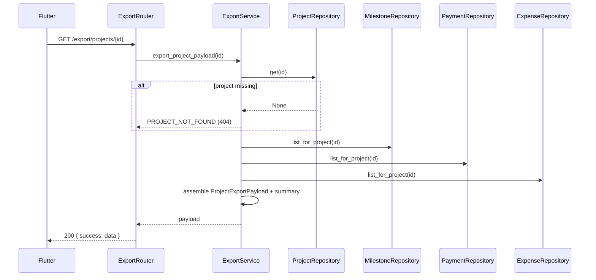

# Sprint 05 — Service Workflows

> **Project:** Construction ERP  
> **Sprint:** S05  
> **Period:** 2026-08-31 to 2026-09-11  
> **Lead:** Tech Lead  
> **Goal:** Add file attachment management for projects and export support for reports (CSV) and project summaries (PDF-ready).  
> **Source:** Construction ERP Software Requirements & Technical Documentation v1.0  
> **Status:** Developer Specification

## 1. Upload Workflow

```mermaid
sequenceDiagram
    participant FE as Flutter
    participant API as FilesRouter
    participant FS as FileService
    participant DB as FileRepository
    participant Disk
    FE->>API: POST /files/upload (multipart: file, project_id, category)
    API->>FS: save_upload(file, project_id, category)
    FS->>FS: validate size <= MAX_FILE_SIZE_MB
    FS->>FS: validate content_type in ALLOWED_FILE_TYPES
    FS->>FS: sanitize filename (secure_filename)
    FS->>FS: build path {UPLOAD_DIR}/{project_id}/{file_id}-{safe_name}
    FS->>FS: prefix-check resolved path under UPLOAD_DIR
    FS->>Disk: create parent dir; stream bytes; track size
    alt size exceeds limit mid-stream
        FS-->>API: FILE_TOO_LARGE (413)
        API-->>FE: 413 error
    end
    FS->>DB: insert FileModel (file_path, size, ...)
    DB-->>FS: row committed
    FS-->>API: UploadResponse(file_id, ...)
    API-->>FE: 201 { success, data }
```

## 2. Download Workflow



## 3. Delete Workflow (Atomic)

```mermaid
sequenceDiagram
    participant FE as Flutter
    participant API as FilesRouter
    participant FS as FileService
    participant DB
    participant Disk
    FE->>API: DELETE /files/{file_id}
    API->>FS: delete_file(file_id)
    FS->>DB: fetch metadata (need file_path + content)
    alt not found
        DB-->>FS: None
        FS-->>API: FILE_NOT_FOUND (404)
    end
    FS->>Disk: delete file at file_path
    alt disk delete fails
        FS-->>API: UPLOAD_FAILED (500); DB row left intact (no orphan)
    end
    FS->>DB: begin transaction; delete row; commit
    alt DB delete fails
        FS->>Disk: restore file (move from temp backup back)
        FS-->>API: UPLOAD_FAILED (500)
    end
    API-->>FE: 204 No Content
```

**Atomicity rule**: disk file is renamed to a `.trash` temporary location first, then DB row is deleted; on DB failure the file is renamed back. This avoids orphaned disk files without losing data on DB rollback.

## 4. CSV Export Workflow



**Rule**: CSV uses the **same aggregation queries** as Sprint 04 reports — no parallel data path. Formatting only (header row + comma-separated values; quote fields containing commas/newlines).

## 5. Project Export Payload Workflow



## 6. Business Rules Summary

| Rule | Where Enforced |
| --- | --- |
| Path safety (no `../`, no absolute paths) | FileService `secure_filename` + resolved-path prefix check |
| Max file size | FileService streams bytes with running counter; aborts on exceed |
| Allowed content types | FileService checks extension + content-type |
| Atomic delete (disk + DB) | FileService rename-to-trash then DB delete then commit/restore |
| CSV reuses report queries | ExportService calls ReportRepository, no duplicate SQL |
| Project export must include all four sections | ExportService asserts non-null project + lists (may be empty) |
| JWT required | `require_admin` dependency on every endpoint |

## 7. Failure Modes

| Scenario | Outcome |
| --- | --- |
| Disk full mid-upload | `UPLOAD_FAILED (500)`; partial file removed; no DB row. |
| DB down after disk write | `UPLOAD_FAILED`; disk file becomes orphan → weekly cleanup. |
| Concurrent delete of same file | First wins (204); second gets `FILE_NOT_FOUND` (404). |
| Invalid report type | `EXPORT_UNAVAILABLE (400)`. |
| Path traversal attempt | `PATH_TRAVERSAL_BLOCKED (400)`; logged + alerted. |